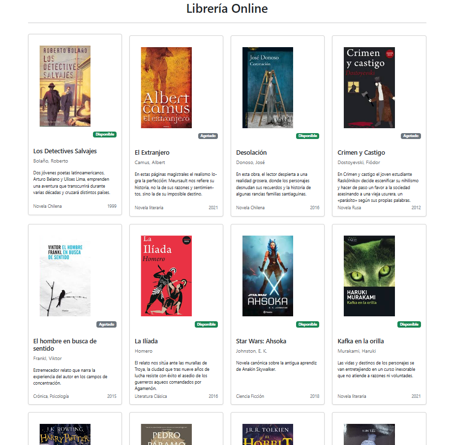
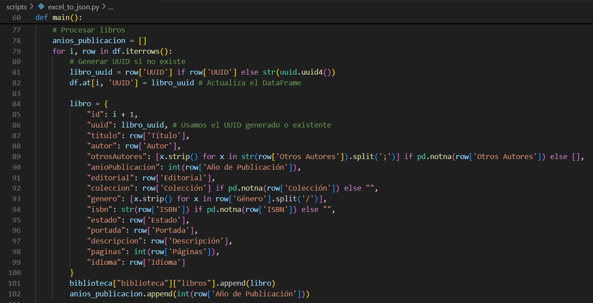
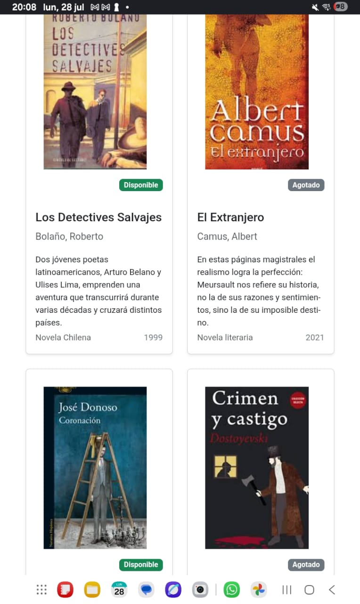
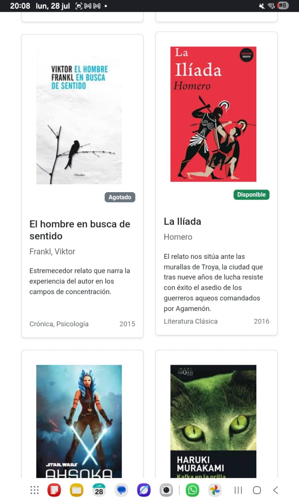
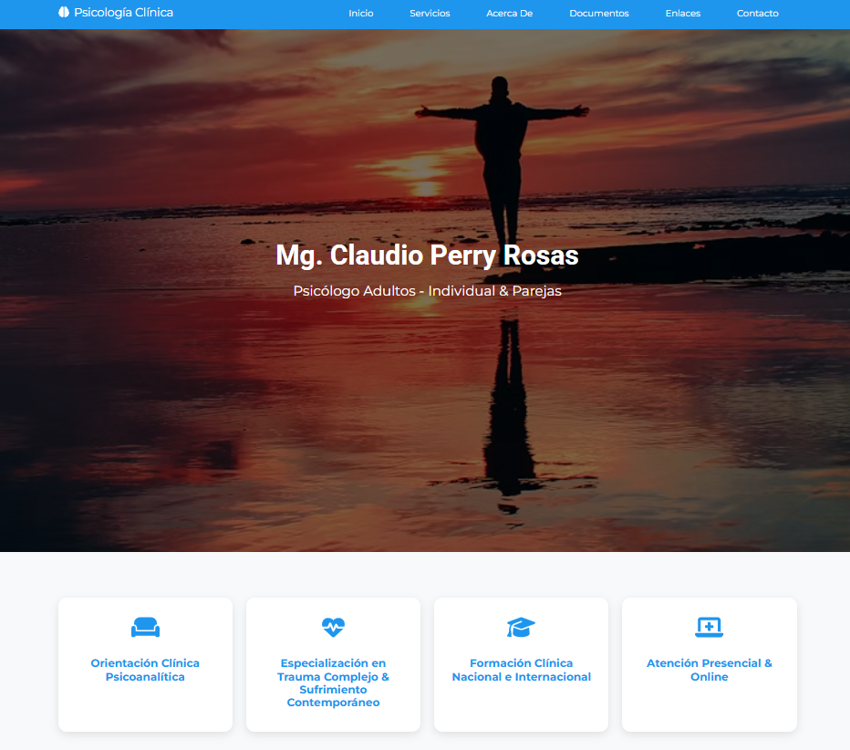
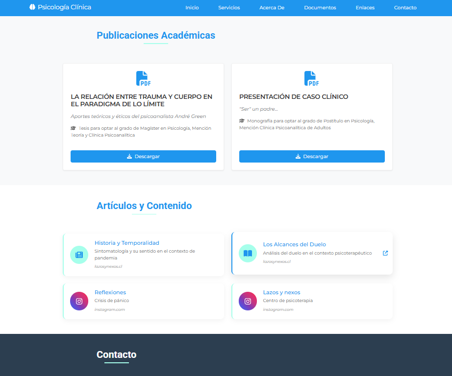
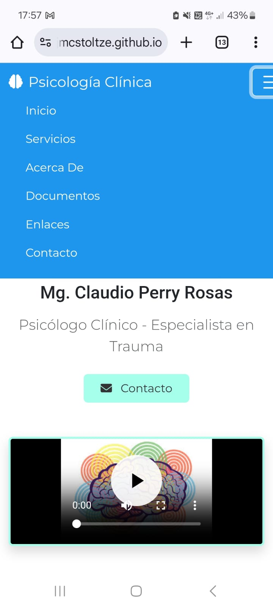
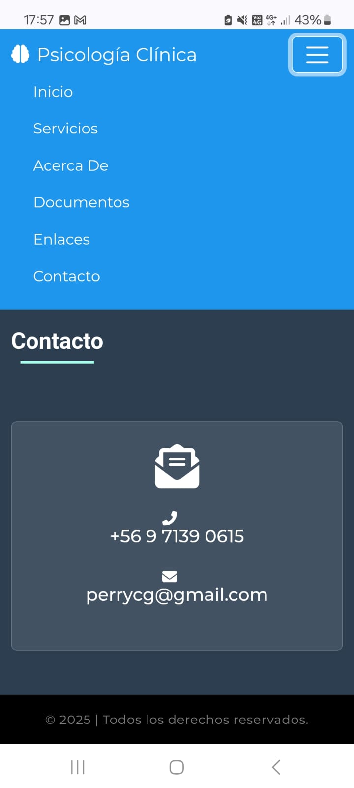
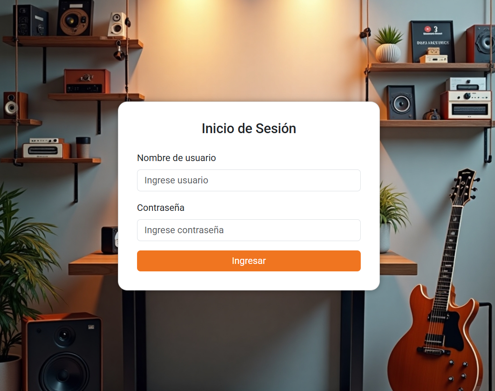
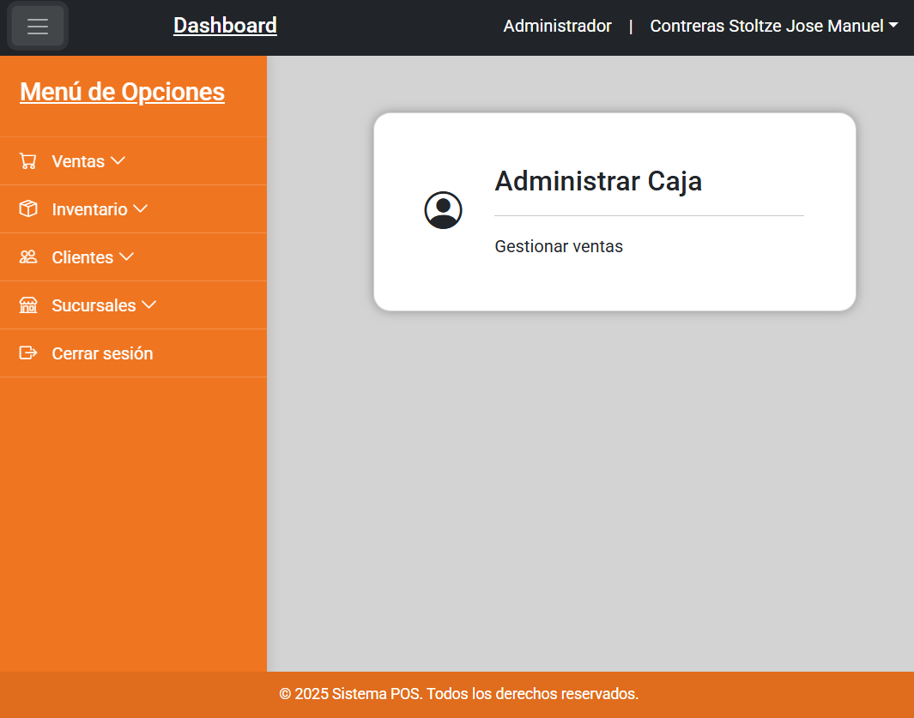

# Jose Contreras Stoltze

- **Fullstack Developer**, with knowledge in various languages and frameworks, mainly Python, Django, JavaScript, Node, and React.
- **Computer Technician** graduated from IPLACEX Professional Institute.
- **Bachelor of Arts** from the University of Chile.

## 🎓📜 Diplomados, Cursos y Certificaciones (Diplomas, Courses, and Certifications)

- Desarrolador Fullstack Python | Django Framework - Desafío Latam *Fullstack Python | Django Framework Developer*
- Programación Orientada a Objetos - *Object-Oriented Programming*
- Diseño y Programación de Bases de Datos - *Database Design and Programming*
- Programación Front End - *Frontend Development*
- Programación Web - *Web Programming*
- Programación Multiplataforma - *Multiplatform Programming*
- Programación Programación Avanzada - *Advanced Programming*
- Integración Continua - *Continuous Integration*
- Python Essentials - CISCO Networking Academy

## 🌟 Trabajos destacados (Featured Work)

### 📚 Script Libreria Online (Script Online Library) 

**Solución digital completa** Convierte datos desde Excel a JSON y renderiza el contenido, para gestión de libros.

🔗 **[Demo en GitHub Pages](https://jmcstoltze.github.io/script-libreria/)**
📂 **[Repositorio](https://github.com/jmcstoltze/script-libreria)**

  

    
    
  

  

    
    
  

### 🧠 Atención Psicológica (Psychology Landing Page)

**Landing page responsiva** desarrollada por encargo con diseño moderno y efectos interactivos.

🔗 **[Demo en GitHub Pages](https://jmcstoltze.github.io/landing-page-psicologia/)**
📂 **[Repositorio](https://github.com/jmcstoltze/landing-page-psicologia)**

  

    
    
  

  

    
    
  

### 🖥️ Prototipo POS (Point of Sale Prototype)

Vistas interactivas de prototipo en desarrollo para Django, Python y PostgreSQL.

🔗 **[Demo interactiva](https://jmcstoltze.github.io/prototipo-pos/)**
📂 **[Repositorio](https://github.com/jmcstoltze/aplicacion-pos)**

  
  

### 🐾 Veterinaria San Blas 

**Aplicación web responsiva** para gestión de clínica veterinaria.  
**Stack**: Python & Django | PostgreSQL (Database)  

🔗 **[Prototipo interactivo](https://jmcstoltze.github.io/front_san_blas/)**
📂 **[Repositorio](https://github.com/jmcstoltze/veterinaria-san-blas)**

  

  
  

### 📚 Reseñas de Libros (Book Reviews Platform)

Sitio Web responsive, desarrollado con Django.

📂 **[Repositorio](https://github.com/jmcstoltze/proyecto_libros_django)**

  
  
  
  
  

## 📊 GitHub Stats

## 🛠 Stack Tecnológico (Tech Stack)

### 🎨 Frontend

### ⚙️ Backend

### 🛠️ Herramientas (Tools)

## 📬 Contacto (Contact)

- Email: **<jmcontreras.stoltze@gmail.com>**
- Linkedin: **[https://www.linkedin.com/in/jose-contreras-stoltze]**
- Vimeo: **[https://vimeo.com/jmcontreras]**
