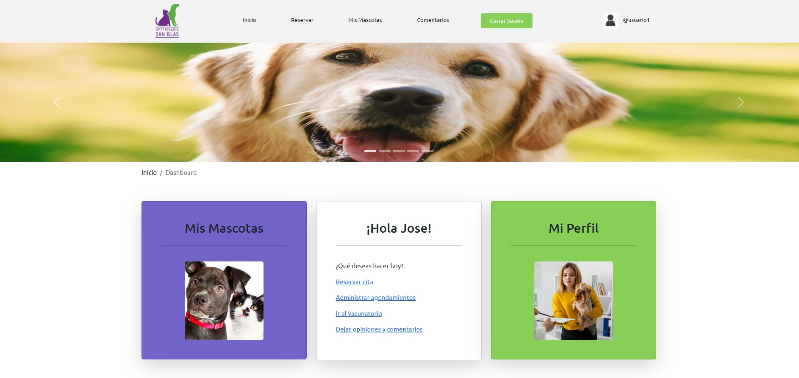
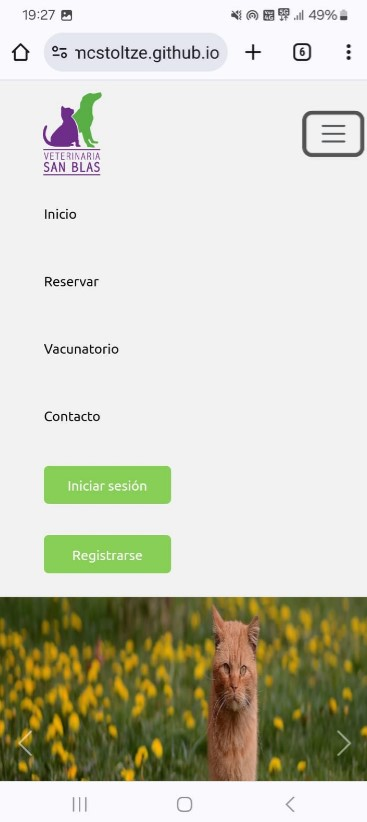
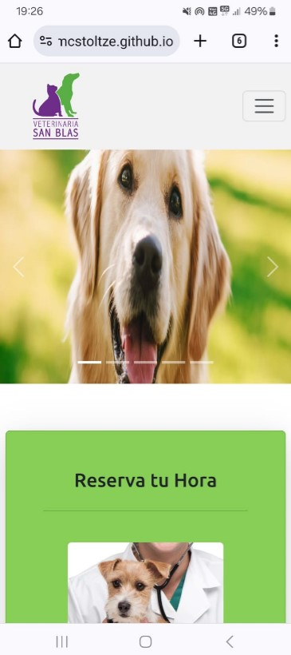
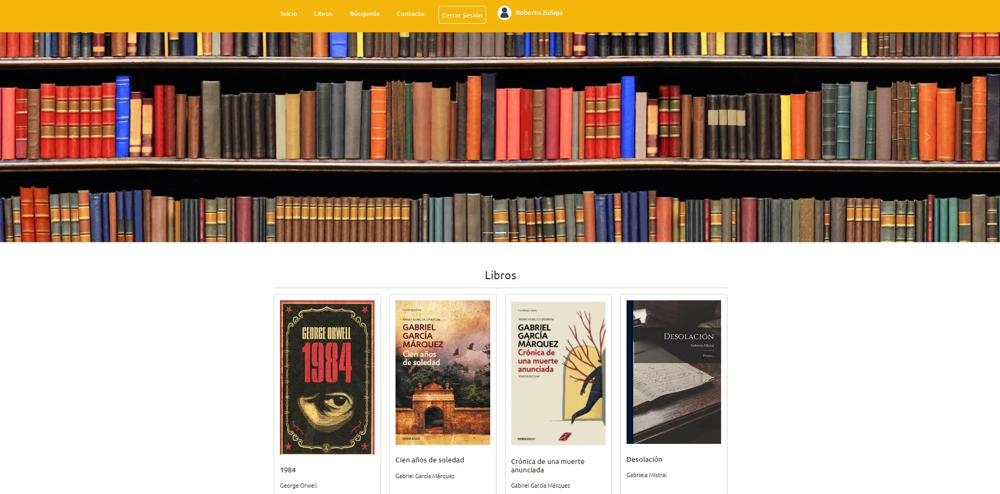
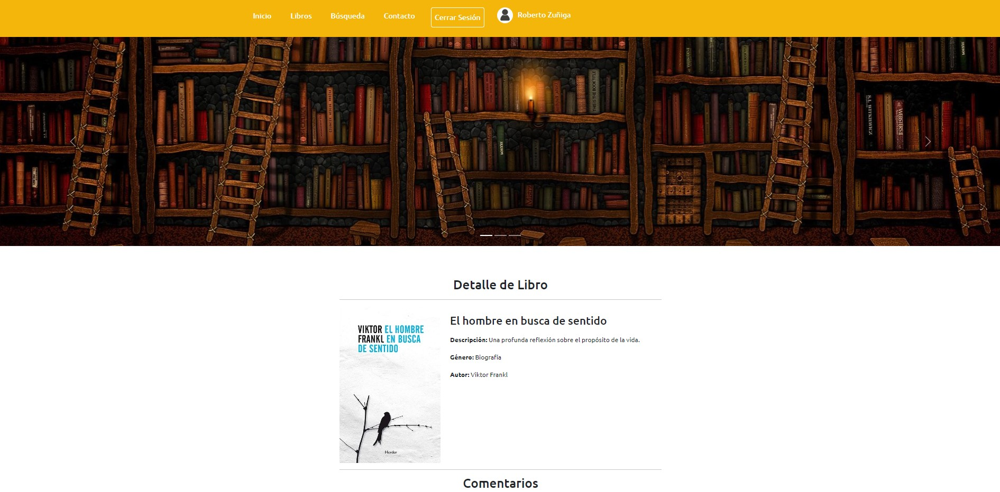
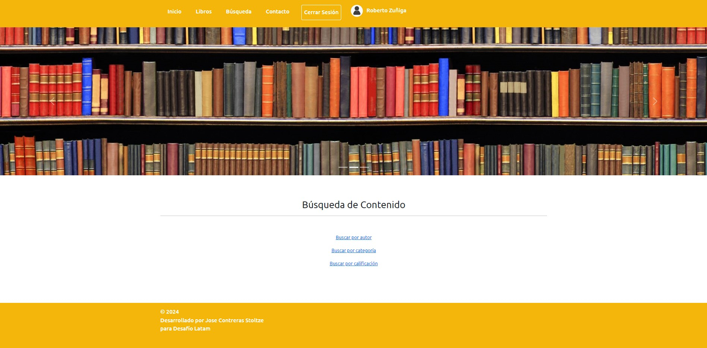

# Jose Contreras Stoltze

- **Fullstack Developer**, with knowledge in various languages and frameworks, mainly Python, Django, JavaScript, Node, and React.
- **Computer Technician** graduated from IPLACEX Professional Institute.
- **Bachelor of Arts** from the University of Chile.

## Diplomados, Cursos y Certificaciones (Diplomas, Courses, and Certifications)

- Desarrolador Fullstack Python | Django Framework - Desafío Latam *Fullstack Python | Django Framework Developer*
- Programación Orientada a Objetos - *Object-Oriented Programming*
- Diseño y Programación de Bases de Datos - *Database Design and Programming*
- Programación Front End - *Frontend Development*
- Programación Web - *Web Programming*
- Programación Multiplataforma - *Multiplatform Programming*
- Programación Programación Avanzada - *Advanced Programming*
- Integración Continua - *Continuous Integration*
- Introduction to Data Science - CISCO Networking Academy
- Python Essentials - CISCO Networking Academy
- Certificado Análisis de Datos | Google - *Data Analysis Certificate*
- Certificación Oracle Next Education | ORACLE Alura Latam - *Oracle Next Education Certification*

## Trabajos destacados (Featured Work)

### Veterinaria San Blas

[https://github.com/jmcstoltze/veterinaria-san-blas]
[https://veterinaria-san-blas.onrender.com/]

Aplicación web responsiva diseñada para la atención médica veterinaria. Desarrollada con Python & Django

    
    <td>&nbsp;&nbsp;&nbsp;</td>
    

### Reseñas de Libros (Books Reviews)

[https://github.com/jmcstoltze/proyecto_libros_django]

Sitio Web responsive, desarrollado con Django.

## GitHub Stats

## Stack Tecnológico (Tech Stack)

### Frontend

HTML | CSS | Bootstrap | Javascript | React | Vue | JQuery | Ionic | Angular | XAML | Kotlin | Jetpack Compose | Vistas XML

### Backend

Django | Python | Javascript | Typescript | Node | Java | PHP | C# | Entity Framework (.NET) | Axios | JSON | XML | PostgreSQL | SQL Server | Oracle Database | MySQL | SQLite | MongoDB | Amazon Dynamo DB | Firebase

### Herramientas (Tools)

Visual Studio Code | Sublime Text | Visual Studio | NetBeans | Android Studio | IntelliJ IDEA | WSL (Windows Subsystem for Linux) | Git | GitHub | DBeaver | Postman | XAMPP | VirtualBox | VMware

## Contacto

- Email: **<jmcontreras.stoltze@gmail.com>**
- Linkedin **[https://www.linkedin.com/in/jose-contreras-stoltze]**
